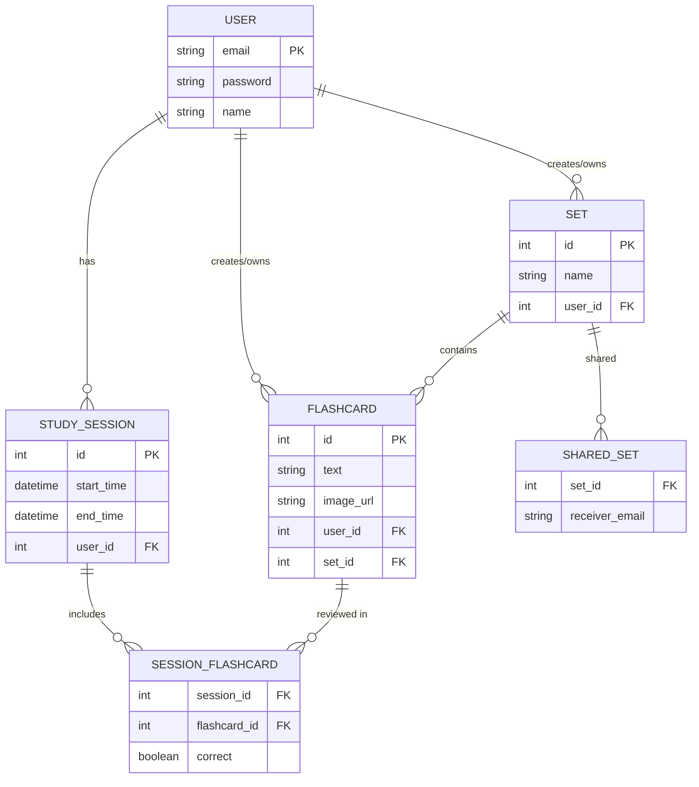

# FlashLearn
"FlashLearn is a mobile application designed to facilitate efficient studying through the
use of customizable flashcards. The application will allow users to create, manage, and
study flashcards in a user-friendly interface. FlashLearn will support multiple study
modes, including spaced repetition, quizzes, and interactive games, to enhance
retention and engagement. The app will be developed for browser platforms, ensuring 
accessibility for a broad user base."
## ER Diagram

