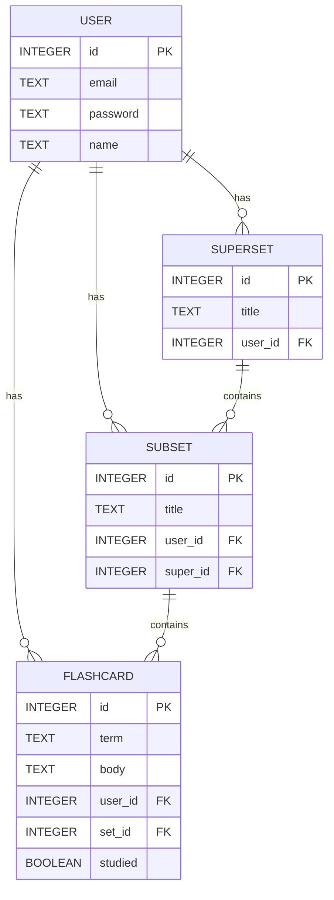
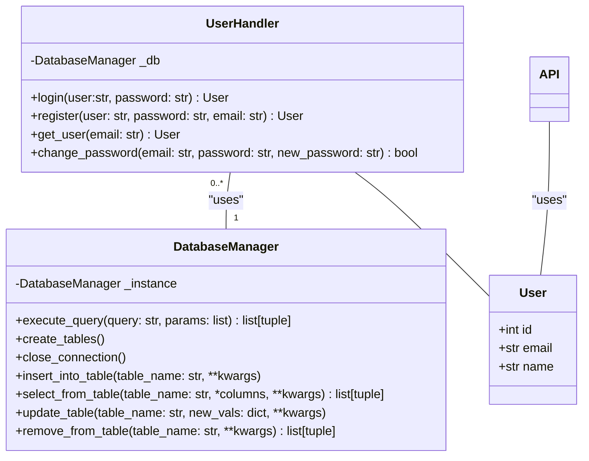
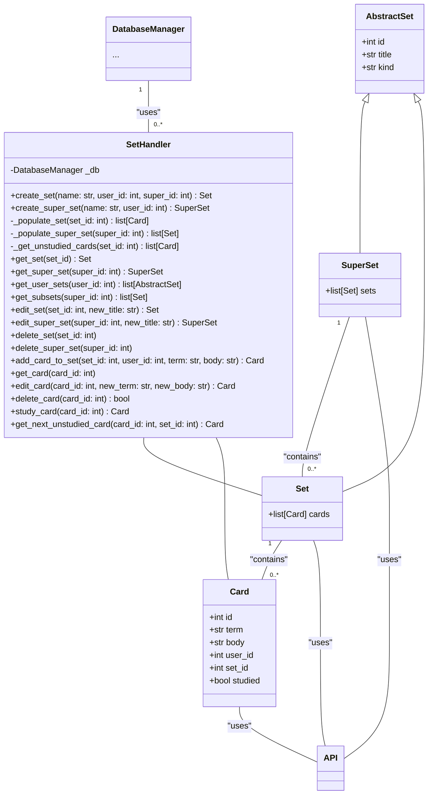
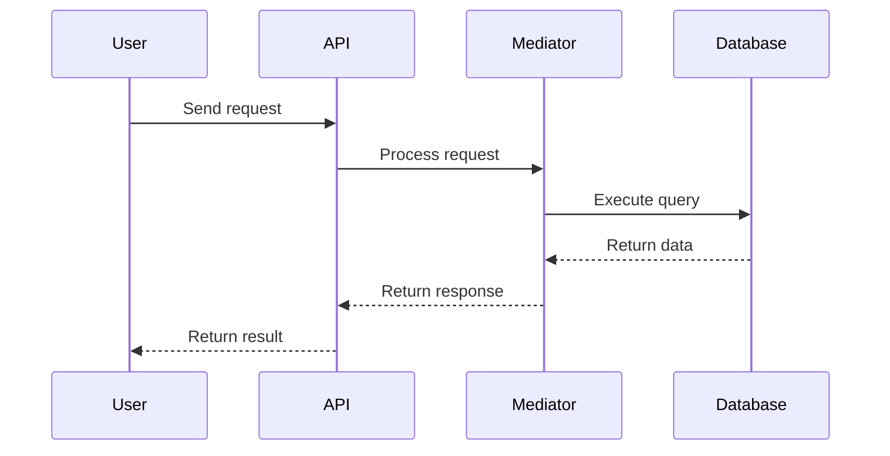
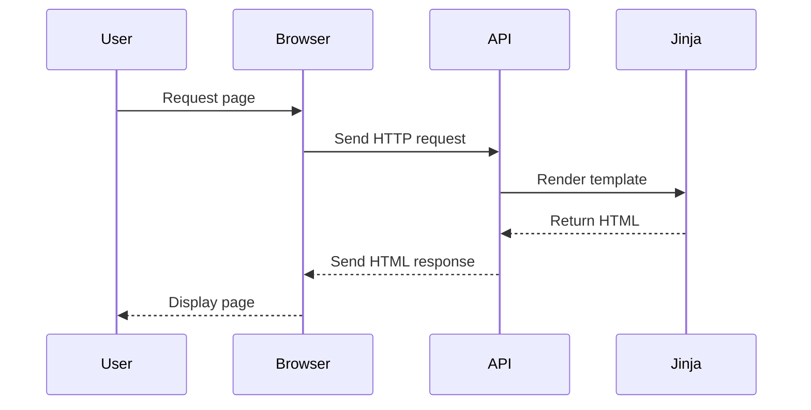

# FlashLearn
"FlashLearn is a mobile application designed to facilitate efficient studying through the
use of customizable flashcards. The application will allow users to create, manage, and
study flashcards in a user-friendly interface. FlashLearn will support multiple study
modes, including spaced repetition, quizzes, and interactive games, to enhance
retention and engagement. The app will be developed for browser platforms, ensuring 
accessibility for a broad user base."

# Running the program
Utilizing the [devcontainer.json](.devcontainer/devcontainer.json) file, you can construct a Docker image for this project upon downloading the repository. Once the image is built, all dependencies and commands are ensured, and all you need to do is type `run` in the container's terminal

Note: the terminal may need to be restarted upon building the image for `run` to function

# UML Diagrams
## ER Diagram

## Class Diagrams
### Users

### Sets

## Sequence Diagrams
### Database Interactions

The "Mediator" participant is referencing the UserHandler and SetHandler objects

### User Interface Serving
